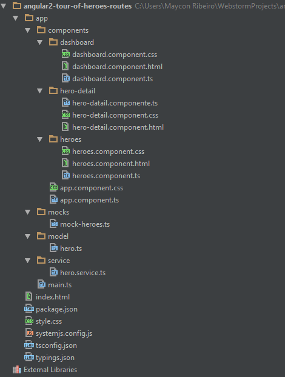

# angular2-tour-of-heroes-routes
Introdução Angular2, neste projeto estão as novas formas de definir as routers, directives e services no Angular2. 
Novas sintaxes do Angular2 *NgIf e *NgFor e outras.  
E o Typescript como linguagem compilada que gera um .js atraves de meta-programação (Anotações).

# Estrutura
  

# Run App
 *$npm install*
 
 *$npm start*

